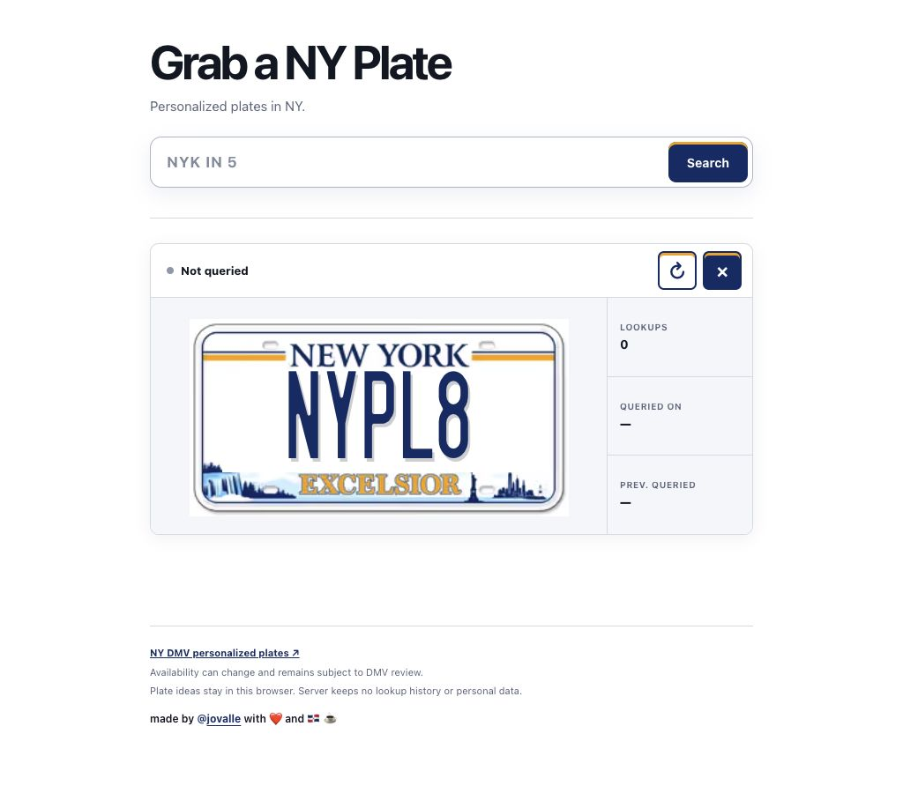
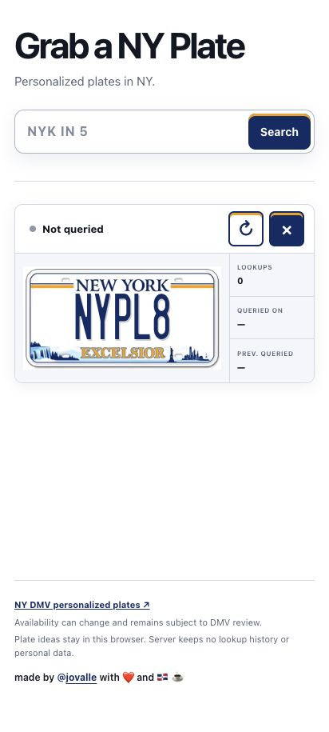

# nypl8

A local-first dashboard for checking New York personalized plate ideas. Add one plate or a comma-separated batch, preview each idea on a standard plate, and keep the latest result and lookup history in one place.

## Background

The NY DMV personalized-plate flow is an antiquated mess of multiple steps to get one answer. I wanted a way to quickly check one or more ideas and see the results in a single view.

The DMV has no public API for this, so I built a small Node service to run the checks in a browser-like session and return the result to the local frontend.

## Screenshots

<p align="center">
  
</p>

<p align="center">
  
</p>

## Setup and run

```bash
git clone git@github.com:jovalle/nypl8.git
cd nypl8
npm run setup
npm start
```

`npm run setup` installs the dashboard and lookup-service dependencies, then creates a production build. `npm start` launches both local processes and opens [http://127.0.0.1:5360](http://127.0.0.1:5360).

If you use [`just`](https://github.com/casey/just), the same commands are:

```bash
just setup
just run
```

Enter a plate between 2 and 8 characters and press **Search**. Separate several ideas with commas to add them as a batch. Use `@` inside a plate to preview the New York State separator.

## Local development

Run setup once, then start the dashboard with hot reload:

```bash
npm run dev
```

The app runs at [http://127.0.0.1:5360](http://127.0.0.1:5360). To test it from a phone or another device on your network, bind the dashboard to all local interfaces:

```bash
npm run dev:lan
```

Use your computer's LAN address from the other device, for example `http://192.168.1.20:5360`.

Common checks:

```bash
npm test          # unit and backend tests
npm run check     # lint, types, production build, and tests
npm run test:browser
```

## Architecture

nypl8 runs two processes on your machine:

- The Next.js app serves the React interface on port `5360`. Its route handlers save the plate list and proxy availability requests.
- A small Node service listens on `127.0.0.1:8080`. It opens an isolated, browser-compatible TLS session for each check and submits the plate to the NY DMV.

The browser talks to the Next.js app over the same origin. `/api/check` forwards one normalized plate to the local lookup service, which maps the DMV redirect to `available`, `unavailable`, or `error`. Checks run one at a time to keep the DMV interaction controlled.

## Local data and privacy

The Next.js app writes saved cards to `data/plates.json`. The browser also keeps a `localStorage` copy as a fallback if the local API is unavailable. The data includes plate ideas, lookup status, check count, and the two most recent check times.

Set a different data directory before starting the app:

```bash
NYPL8_DATA_DIR=/path/to/folder npm start
```

nypl8 has no accounts, analytics, or hosted database. Your saved list stays on your machine. The local lookup service sends a plate value to the NY DMV when you ask it to run a check.

## License

[MIT](LICENSE)
