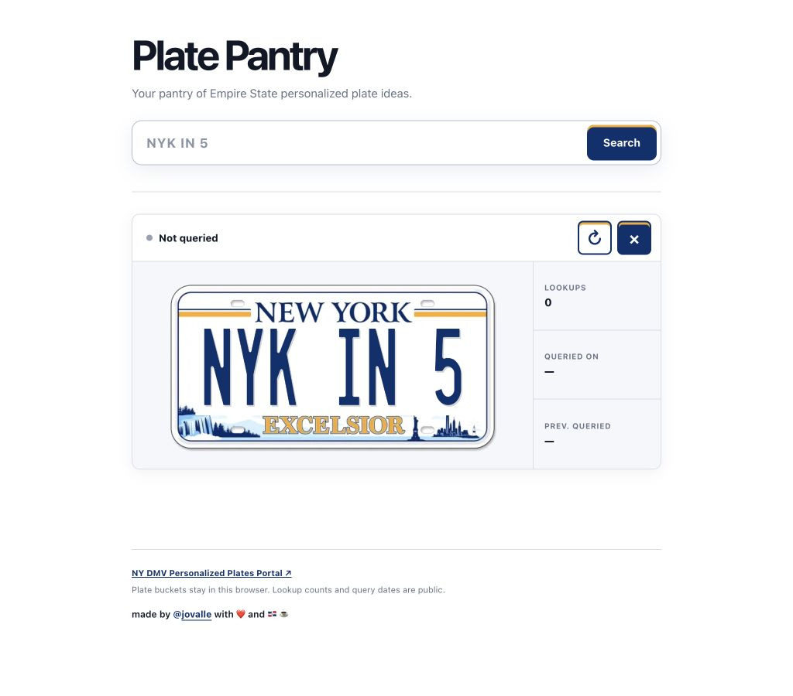

# Plate Pantry

Your pantry of Empire State personalized plate ideas.

Live at [jayro.dev/plate-pantry](https://jayro.dev/plate-pantry). Plate buckets stay in
each visitor's browser; aggregate lookup counts and query dates are stored on the server and
shown whenever that plate is added locally.

## Development

- `just dev` starts the local app.
- `just fmt` formats the repository.
- `just check` runs formatting checks, linting, type checks, the production build, unit tests,
  backend tests, edge tests, and browser tests.
- `just publish` starts the gated production workflow. Releases also run automatically from
  `main` after the full check passes.

## Screenshots

  

## License

[MIT](LICENSE)

  made with <strong>❤️</strong> and <strong>🇩🇴 ☕️</strong>

